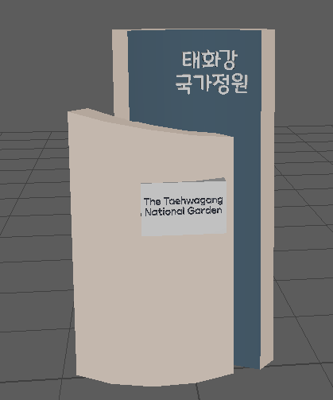
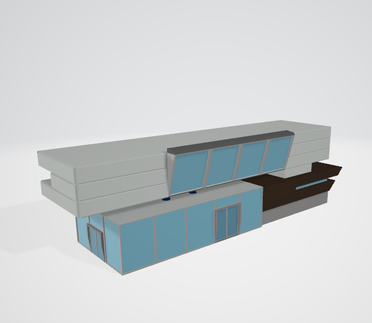

# :computer: Let's go!! 지하철로 떠나는 부울경 수학여행

 
**한국컨텐츠 진흥원에서 추최하는 </u>인공지능 컨텐츠 인재양성</u> 프로젝트** 강의를 수강
- 진행상황으로는 Zepeto와 Unity로 제작
- 이때, Zepeto월드 내 사용가능한 건물 에셋으로는 한계가 있어,
- 3D Moedling 프로그램인 <mark>Maya</mark>를 사용해서 필요한 조형물 및 건물을 제작

**내가 소속한 조는 3개의 월드, <amrk>부산,울산,김해</mark> 를 제작**
- [**제작 영상**](https://youtu.be/UNeIxX8W_rk)
- 현재 제페토에 월드 등록
- 울산은 태화강 국가정원 안에 있는 만남의광장에 위치한 조형물 제작
- 부산은 송정역을 제작하여, 3개의 월드 내, 역사로 사용
- 김해는 김해 천문대에 있는 천문대를 약식 건물로 제작

 - - -
:camera: 제작 과정 및 사진
- 울산 

- 김해 

- 지하철역

